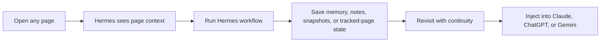

# Hermes Relay for Chrome

<p align="center">
  
</p>

> The browser extension for [Hermes Agent](https://hermes-agent.nousresearch.com/) by Nous Research. Hermes Relay gives Hermes a direct line into the browser for page context, revisit continuity, tracked pages, and AI handoff.

Hermes Relay turns the browser into a working surface for Hermes Agent.
It lets Hermes understand the page you are on, remember what mattered there, return with continuity later, and hand off clean context bundles into assistants like Claude, ChatGPT, and Gemini.

---

## Why Hermes Relay

[Hermes Agent](https://hermes-agent.nousresearch.com/) is built to live on your machine, remember what it learns, and grow more capable over time.
Hermes Relay is the browser companion for that agent, so you can:

- ask Hermes about the page you are reading right now
- keep continuity on important pages with notes, pins, tracked pages, and snapshots
- revisit a page and understand what changed since the last time Hermes saw it
- save durable facts, preferences, and workflows into Hermes memory
- turn page context into summaries, action plans, replies, and task lists
- build compact context bundles for other AI assistants
- inject those bundles directly into supported chat inputs

---

## Product Shape



---

## Highlights

### Popup

The popup is now a fast launcher instead of a mini workspace:

- local Hermes connection flow
- current-page continuity check so you can tell whether Hermes has seen this page before
- one-field quick prompt
- fast actions for summarizing the page, asking Hermes, building context, and jumping into the full workspace
- latest workspace output preview

### Workspace side panel

The side panel is the primary workspace for ongoing page work:

- current-page context view
- continuity banner for pages Hermes has already seen
- page notes
- page snapshots and snapshot comparison
- direct line thread for page-aware conversation
- workflow runner for page-aware Hermes actions
- memory actions
- tracked-page review with search and pinning
- workspace history

### Browser integration

Hermes Relay also hooks into the browser directly:

- context menus for selection and page actions
- keyboard shortcuts for capture and context workflows
- chat input injection on:
  - `claude.ai`
  - `chatgpt.com`
  - `chat.openai.com`
  - `gemini.google.com`

---

## Supported workflows

| Workflow | What it does |
| --- | --- |
| Ask | Explain what matters on the current page |
| Summarize | Produce a high-signal summary |
| Next Steps | Turn page context into an action plan |
| Draft Reply | Draft a response based on the page |
| Extract Tasks | Pull out tasks, decisions, blockers, and open questions |
| Research | Turn the page into a compact research brief |
| Compare | Compare options or claims on the page |
| Capture | Save the page as a useful Hermes retrieval artifact |
| Memory Actions | Persist facts, preferences, or workflows when durable |
| Build Context | Create a compact bundle for another assistant |
| Inject Context | Insert the latest Hermes context into a supported chat input |

---

## Requirements

Before using Hermes Relay, make sure you have:

- Chrome **114+**
- a local Hermes Agent installation
- the Hermes API server enabled
- a local Hermes API key

---

## Hermes setup

Hermes Relay for Chrome expects the official Hermes Agent API server to be running locally.

Add the following to `~/.hermes/.env`:

```bash
API_SERVER_ENABLED=true
API_SERVER_KEY=change-me-local-dev
```

Then start Hermes:

```bash
hermes gateway
```

Default local API:

```text
http://127.0.0.1:8642
```

From this repo, you can also run:

```bash
npm run setup:local
```

That local helper checks `~/.hermes/.env`, probes the common local Hermes API URLs, and prints the exact extension and zip paths you can load in Chrome.

Official references:

- [Hermes Agent](https://hermes-agent.nousresearch.com/)
- [Hermes Agent docs](https://hermes-agent.nousresearch.com/docs/)
- [API Server docs](https://hermes-agent.nousresearch.com/docs/user-guide/features/api-server/)
- [Memory docs](https://hermes-agent.nousresearch.com/docs/user-guide/features/memory/)

---

## Quick start

### 1. Load the extension

1. Open `chrome://extensions`
2. Enable **Developer mode**
3. Click **Load unpacked**
4. Select `hermes-relay/extension`

### 2. Connect Hermes Relay

1. Open the Hermes Relay popup
2. Let the popup auto-detect your local Hermes server
3. Paste your local Hermes API key
4. Keep the detected base URL unless you are intentionally using a different local server
5. Click **Save & Test**

### 3. Use it on a page

A good first run looks like this:

1. Open any article, app page, or thread
2. Follow the popup checklist until all three setup steps are green
3. Click **Summarize** or **Ask**
4. Save a note or snapshot if the page matters later
5. Open the **Workspace** side panel for continuity, notes, snapshots, and memory actions
6. Use **Build Context** to create a handoff bundle, then **Insert Latest** on Claude, ChatGPT, or Gemini

---

## Keyboard shortcuts

| Shortcut | Action |
| --- | --- |
| `Alt+Shift+H` | Capture current page |
| `Alt+Shift+C` | Build Hermes context |
| `Alt+Shift+I` | Inject latest Hermes context |

---

## Context menus

Hermes Relay adds browser context-menu actions for quick, in-page use. Selection and page actions route into the Hermes Workspace side panel by default so your browsing flow stays intact:

- **Explain this selection with Hermes**
- **Save this selection to Hermes memory**
- **Open this page in Hermes Workspace**
- **Insert latest Hermes context here**

---

## Validate the project

From `hermes-relay/`:

```bash
npm run check
```

This validates:

- `extension/manifest.json`
- `extension/background.js`
- `extension/content/chat.js`
- `extension/popup/popup.js`
- `extension/sidepanel/sidepanel.js`
- smoke tests under `test/`

---

## Package for Chrome

Build an uploadable Chrome zip from `hermes-relay/`:

```bash
npm run package:chrome
```

This will:

- generate release icons in `extension/icons/`
- create `dist/hermes-relay-chrome.zip`

---

## Positioning

Hermes Relay for Chrome is the browser extension for Hermes Agent by Nous Research.
It gives Hermes a direct line into the pages you read, revisit, track, and hand off into AI workflows.

---

## Project layout

```text
hermes-relay/
  .gitignore
  CONTRIBUTING.md
  LICENSE
  README.md
  package.json
  assets/
    readme-hero.svg
  extension/
    manifest.json
    background.js
    lib/
      background/
      shared/
    content/
      chat.js
    popup/
      popup.html
      popup.css
      popup.js
    sidepanel/
      sidepanel.html
      sidepanel.css
      sidepanel.js
  test/
```

---

## Architecture at a glance

- `background.js` is the extension control plane
- `content/chat.js` handles chat-input insertion on supported assistant sites
- `popup/` is the lightweight quick-action surface
- `sidepanel/` is the richer workspace surface
- local storage is used for config, recents, notes, tracked pages, and snapshots
- Hermes Relay talks to the local Hermes API server rather than a remote hosted backend

---

## Near-term roadmap

- smarter provider-specific injection behavior
- better Hermes memory receipts and recall flows
- richer watchlist review actions
- packaging, icons, and store-readiness

---

## Contributing

Contributions are welcome.
If you are extending workflows, refining the UI, or improving browser integrations, start by reading [`CONTRIBUTING.md`](./CONTRIBUTING.md).

---

## License

See [`LICENSE`](./LICENSE).
