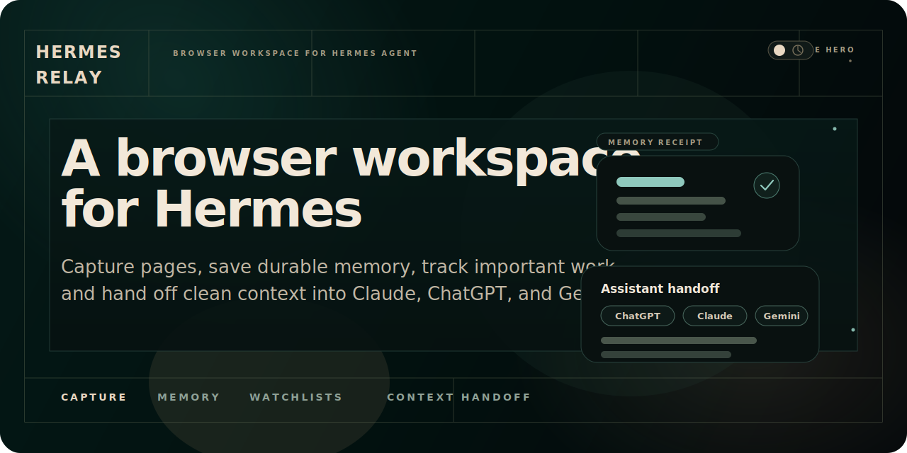
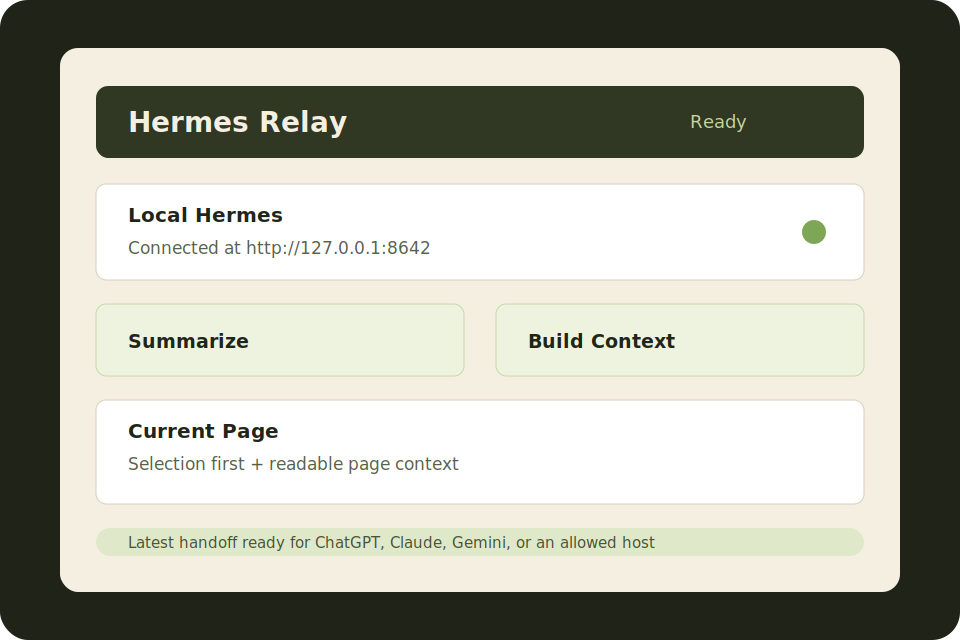
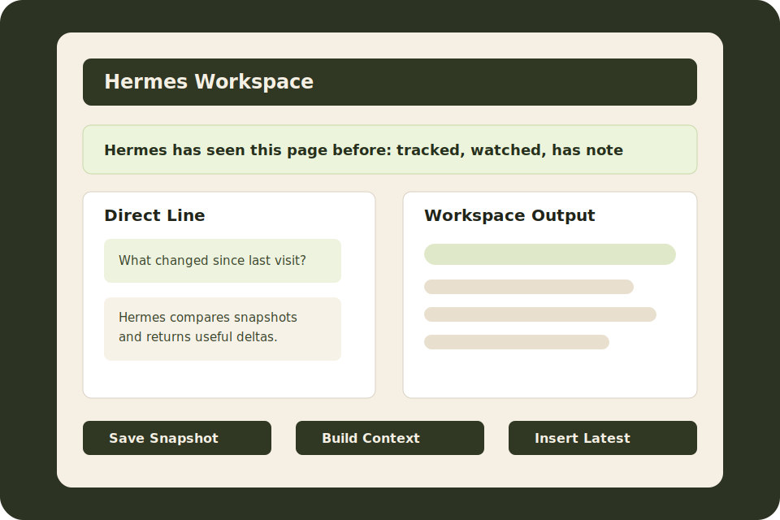
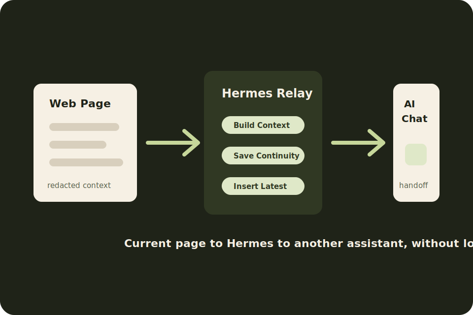

# Hermes Relay for Chrome

<p align="center">
  
</p>

Hermes Relay for Chrome gives local **Hermes Agent** browser context, revisit continuity, and AI handoff.

It is a Chrome Manifest V3 extension for people who want Hermes to understand the page they are reading, keep useful continuity around important pages, and move compact context bundles into assistants like Claude, ChatGPT, and Gemini.

> Hermes Relay is an independent browser companion for [Hermes Agent](https://hermes-agent.nousresearch.com/) by Nous Research. It talks to your local Hermes API server; this repository does not include a hosted backend.

## What It Does

- captures redacted context from the current browser page
- runs page-aware Hermes workflows such as Ask, Summarize, Next Steps, Extract Tasks, Research, Compare, and Build Context
- saves page notes, snapshots, tracked-page state, direct threads, and recent workspace output in Chrome local storage
- helps Hermes recognize pages you revisit
- builds compact handoff bundles for other AI assistants
- inserts the latest handoff context into Claude, ChatGPT, Gemini, or a custom AI host you explicitly allow
- optionally shares browser context with an attached live Hermes terminal session

## Who It Is For

Hermes Relay is currently best for:

- Hermes Agent users running the local API server
- people testing browser continuity and local-first agent workflows
- Hermes Agent maintainers reviewing browser integration ideas
- early contributors who are comfortable loading an unpacked Chrome extension

This is not yet a Chrome Web Store release. The intended public launch path is a GitHub release with source install instructions and a packaged zip.

## Requirements

- Chrome 114 or newer
- local Hermes Agent installation
- Hermes API server enabled
- local Hermes API key
- Node.js and npm for setup, tests, and packaging

Hermes Relay expects the local API to be available at:

```text
http://127.0.0.1:8642
```

It also probes:

```text
http://localhost:8642
```

## Install From Source

1. Clone this repository.
2. Open `chrome://extensions`.
3. Enable **Developer mode**.
4. Click **Load unpacked**.
5. Select the `extension/` folder only.
6. Pin Hermes Relay if you want quick popup access.

Do not load generated or copied extension folders during development. The canonical source folder is `extension/`.

## Local Hermes Setup

Add this to `~/.hermes/.env`:

```bash
API_SERVER_ENABLED=true
API_SERVER_KEY=change-me-local-dev
```

Start Hermes:

```bash
hermes gateway
```

Then from this repository run:

```bash
npm run setup:local
```

The setup helper checks common local Hermes API URLs, reads your local API key when available, and writes an ignored development config at `extension/local-dev-config.json`. The packaged zip excludes that file.

Reload the unpacked extension in `chrome://extensions` after setup.

Official Hermes references:

- [Hermes Agent](https://hermes-agent.nousresearch.com/)
- [Hermes Agent docs](https://hermes-agent.nousresearch.com/docs/)
- [API Server docs](https://hermes-agent.nousresearch.com/docs/user-guide/features/api-server/)
- [Memory docs](https://hermes-agent.nousresearch.com/docs/user-guide/features/memory/)

## Core Workflow

1. Open an article, app page, issue, pull request, thread, or document.
2. Open the Hermes Relay popup.
3. Confirm Hermes is reachable and authenticated.
4. Run **Summarize**, **Ask**, **Extract Facts**, or **Build Context**.
5. Open the side panel for notes, snapshots, tracked pages, direct page-aware conversation, and workspace history.
6. Use **Insert Latest** on Claude, ChatGPT, Gemini, or a user-approved AI host when you want to continue elsewhere.

Keyboard shortcuts:

| Shortcut | Action |
| --- | --- |
| `Alt+Shift+H` | Capture current page |
| `Alt+Shift+C` | Build Hermes context |
| `Alt+Shift+I` | Inject latest Hermes context |

Context menu actions:

- **Explain this selection with Hermes**
- **Save this selection to Hermes memory**
- **Open this page in Hermes Workspace**
- **Insert latest Hermes context here**

## Demo Media

These launch images show the intended first-run story and product surfaces.

| Popup | Workspace | Handoff |
| --- | --- | --- |
|  |  |  |

## Architecture

Hermes Relay is split into small extension surfaces:

- `extension/background.js` is the service worker control plane. It initializes storage, context menus, watchers, live events, and message routing.
- `extension/lib/background/page-context.js` extracts active-page context through `chrome.scripting`.
- `extension/lib/background/hermes-client.js` talks to the local Hermes API server.
- `extension/lib/background/workflows.js` builds browser-context envelopes and routes workflows to standalone Hermes responses or live sessions.
- `extension/lib/background/storage.js` normalizes Chrome local storage for config, notes, snapshots, tracked pages, direct threads, recent actions, live events, and workspace state.
- `extension/content/chat.js` inserts saved handoff context into supported assistant inputs.
- `extension/popup/` provides fast setup and quick actions.
- `extension/sidepanel/` provides the full workspace.

Hermes API assumptions:

- `GET /health` for local server readiness
- `GET /v1/models` for authenticated preflight when available
- `POST /v1/responses` for standalone Hermes responses
- `GET /v1/live-sessions/current` for attached live-session discovery
- live-session command, event, browser-event, browser-result, and approval endpoints for shared terminal workflows

## Privacy And Security

Hermes Relay is local-first:

- no hosted backend is included in this project
- local configuration is stored in Chrome extension storage
- local development config is ignored and excluded from release zips
- page context is redacted before it is sent to Hermes
- chat insertion is user-directed
- custom AI hosts require explicit user approval

Read:

- [Privacy](./PRIVACY.md)
- [Security](./SECURITY.md)
- [Support](./SUPPORT.md)

## Known Limitations

- Hermes Relay requires a local Hermes Agent API server.
- Chat input insertion depends on assistant page structure and may need updates when Claude, ChatGPT, Gemini, or custom hosts change their DOM.
- Live-session and approval flows are early integration surfaces and may change with Hermes Agent.
- Redaction reduces risk but cannot guarantee that every sensitive value is removed.
- Chrome internal pages such as `chrome://extensions` cannot be inspected by the extension.

## For Hermes Agent Maintainers

Useful review areas:

- whether the browser-context envelope matches Hermes Agent expectations
- whether the local API assumptions should be formalized or adjusted
- whether live-session browser events and approval payloads should use a different shape
- whether memory actions should return richer receipts
- whether Hermes should own a first-party browser companion interface long term

The extension intentionally avoids remote hosted logic and keeps browser actions user-directed.

## Validate

Run the full check suite:

```bash
npm run check
```

This validates:

- manifest JSON
- JavaScript syntax
- unit tests under `test/*.test.js`
- fixture e2e coverage under `test/e2e/`

## Package A GitHub Release Zip

Build the Chrome extension zip:

```bash
npm run package:chrome
```

The uploadable zip is written to:

```text
dist/hermes-relay-chrome.zip
```

The package script also generates release PNG icons in `extension/icons/` and excludes local-only config such as `extension/local-dev-config.json`.

See [Chrome Release](./CHROME_RELEASE.md) for the public-launch checklist.

## Contributing

Start with [CONTRIBUTING.md](./CONTRIBUTING.md), then run:

```bash
npm run check
```

Good first areas:

- provider-specific chat insertion hardening
- better empty and error states
- watchlist review workflows
- release packaging and docs
- Hermes API contract review

## License

See [LICENSE](./LICENSE).
