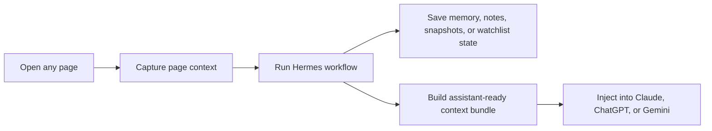

# Hermes Relay

> A standalone Chrome extension for [Hermes Agent](https://hermes-agent.nousresearch.com/) that gives Hermes a browser-native control layer for capture, memory, watchlists, and AI context handoff.

Hermes Relay turns the browser into a working surface for Hermes.
It lets you understand the page you are on, save durable context, track pages over time, and hand off clean context bundles into other assistants like Claude, ChatGPT, and Gemini.

---

## Why Hermes Relay

Hermes is great at reasoning, memory, and workflow support.
Hermes Relay gives it a practical browser UI so you can:

- ask Hermes about the page you are currently reading
- summarize, extract tasks, draft replies, and plan next steps
- save durable facts, preferences, and workflows into Hermes memory
- track important pages with notes, pins, and snapshots
- compare the current page with a previous snapshot
- build compact context bundles for other AI assistants
- inject those bundles directly into supported chat inputs

---

## What It Feels Like



---

## Highlights

### Popup

The popup is designed for fast, in-the-moment work:

- local Hermes connection flow
- quick page actions
- recent runs
- watchlist preview for tracked pages
- build and inject context without leaving the page

### Workspace side panel

The side panel is the heavier workspace for ongoing page work:

- current-page context view
- page notes
- page snapshots and snapshot comparison
- workflow runner
- memory actions
- tracked-page watchlist with search and pinning
- workspace history

### Browser integration

Hermes Relay also hooks into the browser directly:

- context menus for selection and page actions
- keyboard shortcuts for capture and context workflows
- chat input injection on:
  - `claude.ai`
  - `chatgpt.com`
  - `chat.openai.com`
  - `gemini.google.com`

---

## Supported workflows

| Workflow | What it does |
| --- | --- |
| Ask | Explain what matters on the current page |
| Summarize | Produce a high-signal summary |
| Next Steps | Turn page context into an action plan |
| Draft Reply | Draft a response based on the page |
| Extract Tasks | Pull out tasks, decisions, blockers, and open questions |
| Research | Turn the page into a compact research brief |
| Compare | Compare options or claims on the page |
| Capture | Save the page as a useful Hermes retrieval artifact |
| Memory Actions | Persist facts, preferences, or workflows when durable |
| Build Context | Create a compact bundle for another assistant |
| Inject Context | Insert the latest Hermes context into a supported chat input |

---

## Requirements

Before using Hermes Relay, make sure you have:

- Chrome **114+**
- a local Hermes installation
- the Hermes API server enabled
- a local Hermes API key

---

## Hermes setup

Hermes Relay expects the official Hermes API server to be running locally.

Add the following to `~/.hermes/.env`:

```bash
API_SERVER_ENABLED=true
API_SERVER_KEY=change-me-local-dev
```

Then start Hermes:

```bash
hermes gateway
```

Default local API:

```text
http://127.0.0.1:8642
```

Official references:

- [Hermes Agent docs](https://hermes-agent.nousresearch.com/docs/)
- [API Server docs](https://hermes-agent.nousresearch.com/docs/user-guide/features/api-server/)
- [Memory docs](https://hermes-agent.nousresearch.com/docs/user-guide/features/memory/)

---

## Quick start

### 1. Load the extension

1. Open `chrome://extensions`
2. Enable **Developer mode**
3. Click **Load unpacked**
4. Select `hermes-relay/extension`

### 2. Connect Hermes Relay

1. Open the Hermes Relay popup
2. Paste your local Hermes API key
3. Keep the default base URL unless you are intentionally using a different local server
4. Click **Connect**

### 3. Use it on a page

A good first run looks like this:

1. Open any article, app page, or thread
2. Click **Summarize** or **Ask**
3. Try **Capture Page** to save a retrieval artifact
4. Open the **Workspace** side panel for notes, snapshots, and memory actions
5. Use **Build Context** or **Inject Into Chat** to continue work in another assistant

---

## Keyboard shortcuts

| Shortcut | Action |
| --- | --- |
| `Alt+Shift+H` | Capture current page |
| `Alt+Shift+C` | Build Hermes context |
| `Alt+Shift+I` | Inject latest Hermes context |

---

## Context menus

Hermes Relay adds browser context-menu actions for quick, in-page use:

- **Ask Hermes about this selection**
- **Remember this with Hermes**
- **Send this page to Hermes**
- **Inject Hermes context here**

---

## Validate the project

From `hermes-relay/`:

```bash
npm run check
```

This validates:

- `extension/manifest.json`
- `extension/background.js`
- `extension/content/chat.js`
- `extension/popup/popup.js`
- `extension/sidepanel/sidepanel.js`

---

## Package for Chrome

Build an uploadable Chrome zip from `hermes-relay/`:

```bash
npm run package:chrome
```

This will:

- generate release icons in `extension/icons/`
- create `dist/hermes-relay-chrome.zip`

---

## Project layout

```text
hermes-relay/
  .gitignore
  CONTRIBUTING.md
  LICENSE
  README.md
  package.json
  extension/
    manifest.json
    background.js
    content/
      chat.js
    popup/
      popup.html
      popup.css
      popup.js
    sidepanel/
      sidepanel.html
      sidepanel.css
      sidepanel.js
```

---

## Architecture at a glance

- `background.js` is the extension control plane
- `content/chat.js` handles chat-input insertion on supported assistant sites
- `popup/` is the lightweight quick-action surface
- `sidepanel/` is the richer workspace surface
- local storage is used for config, recents, notes, tracked pages, and snapshots
- Hermes Relay talks to the local Hermes API server rather than a remote hosted backend

---

## Near-term roadmap

- smarter provider-specific injection behavior
- better Hermes memory receipts and recall flows
- richer watchlist review actions
- packaging, icons, and store-readiness

---

## Contributing

Contributions are welcome.
If you are extending workflows, refining the UI, or improving browser integrations, start by reading [`CONTRIBUTING.md`](./CONTRIBUTING.md).

---

## License

See [`LICENSE`](./LICENSE).
